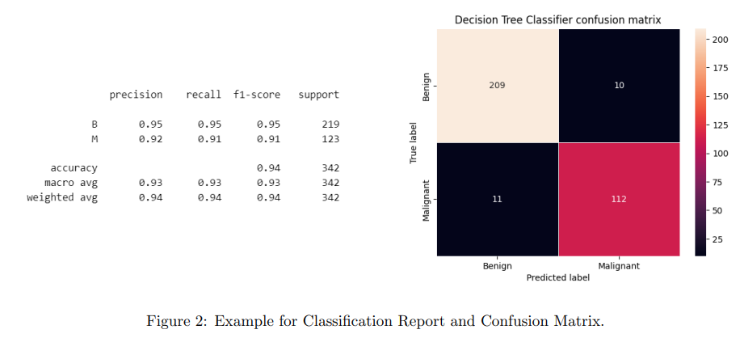

# Lab 2: Decision Tree

## 1. Description

### 1.1 Description

In this assignment, you are going to build a decision tree on the UCI Breast Cancer Wisconsin (Diagnostic) dataset, with support from the scikit-learn library.
The Breast Cancer Wisconsin (Diagnostic) dataset is used for classifying tumors as malignant or benign based on 30 numerical features derived from imaging data. It includes 569 samples, with labels indicating either malignant (M) or benign (B).
Download [here](https://archive.ics.uci.edu/dataset/17/breast+cancer+wisconsin+diagnostic)

### 1.2 Assignment requirements

You are required to write a Python Notebook (.ipynb) and use scikit-learn library to fulfill the following tasks.

Although there is no strict rule on organizing the code, each task should be noted carefully and must reflect all the requirements mentioned.

#### 1.2.1 Preparing the datas sets

This task prepares the training sets and test sets for the incoming experiments.
You can download the dataset via Python as follow:

``` bash
!pip install ucimlrepo
```

``` python
from ucimlrepo import fetch_ucirepo
breast_cancer_wisconsin_diagnostic = fetch_ucirepo(id=17)
feature = breast_cancer_wisconsin_diagnostic.data.features
label = breast_cancer_wisconsin_diagnostic.data.targets
```

With features and labels above, please prepare the following four subsets:
• `feature_train`: a set of training samples (target attribute excluded).
• `label_train`: a set of labels corresponding to the samples in `feature_train`.
• `feature_test`: a set of test samples, it is of similar structure to `feature_train.`
• `label_test`: a set of labels corresponding to the samples in `feature_test.`

You need to shuffle the data before splitting and split it in a stratified fashion. Other parameters (if there are any) are left by default.

There will be experiments on training sets and test sets of different proportions, including (train/test) 40/60, 60/40, 80/20, and 90/10; thus, you need 16 subsets.

Visualize the distributions of classes in all the data sets (the original set, training set, and test set) of all proportions to show that you have prepared them appropriately

#### 1.2.2 Building the decision tree classifiers

This task conducts experiments on the designated train/test proportions listed above.
You need to fit an instance of sklearn.tree.DecisionTreeClassifier (with information gain) to each training set and visualize the resulting decision tree using graphviz.


#### 1.2.3 Evaluating the decision tree classifiers

For each of the above decision tree classifiers, predict the examples in the corresponding test set, and make a report using `classification_report` and `confusion_matrix`.



How do you interpret the classification report and the confusion matrix? From that, make your comments on the performances of those decision tree classifiers.

#### 1.2.4 The depth and accuracy of a decision tree

This task works on the 80/20 training set and test set. You need to consider how the decision tree’s depth affects the classification accuracy.

You can specify the maximum depth of a decision tree by varying the parameter max_depth of the decision tree.

You need to try the following values for parameter `max_depth`: None, 2, 3, 4, 5, 6, 7. And then,
• Provide the decision tree drawn by `graphviz` for each `max_depth` value.
• Report to the following table the `accuracy_score` (on the test set) of the decision tree classifier when changing the value of parameter `max_depth`.

| max_depth | None | 2 | 3 | 4 | 5 | 6 | 7 |
| --- | --- | --- | --- | --- | --- | --- | --- |
| Accuracy | | | | | | | |

Make your comment on the above statistics.

## 2. Grading

| No. | Specifications Scores | (%) |
| --- | --- | --- |
| 1 | Preparing the data sets | 30 |
| 2 | Building the decision tree classifiers | 20 |
| 3 | Evaluating the decision tree classifiers | |
| | Classification report and confusion matrix | 10 |
| | Comments | 10 |
| 4 | The depth and accuracy of a decision tree | |
| | Trees, tables, and charts | 20 |
| | Comments | 10 |

## 3. Notice

• This is an INDIVIDUAL assignment.
• You must use Python language and present the code in a single ipynb file.
• Write down your report on a PDF File.
• All the required visualizations must be presented in the ipynb file, while statistical results and comments are
presented in the report.
• A program with syntax/runtime error(s) will not be accepted.
