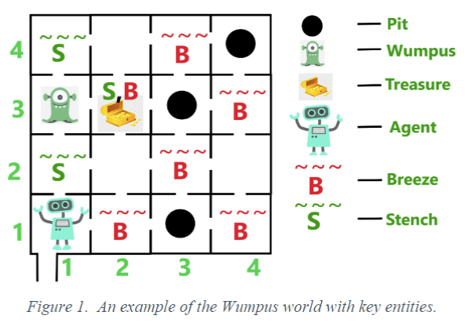

# CSC14003 - Artificial Intelligence </br> Project 02 - Logical Agent

## 1. Wumpus World

The purpose of this project is to design and implement a **logical agent** that navigates through the Wumpus World, a **partially-observable** environment.

The Wumpus World presents the following key features:

- The environment is an underground cave with a network of interconnected two-dimensional rooms.
- A room may contain a *deadly* **pit**, signaled by a perceivable **breeze**, or a *fatal* **Wumpus** *monster*, detectable via a discernible **stench**.
  - The agent will die immediately when entering a room containing one of those harmful factors. No withdrawal is possible.
  - The percepts are available in the *four-neighborhood of the room* containing one of those harmful factors.
- The agent has **arrows** to shoot in the direction he is facing.
- There is one **chest of gold**, located somewhere in the cave.
- Movement options: *forward, turn left, turn right by 90 degrees*.

**The primary objective encompasses locating the gold**. During the journal, the agent may need to kill Wumpus to pursuit success in this environment.

Figure 1 demonstrates an example of the Wumpus world with key entities.


## 2. Project Description

Our Wumpus World for actual implementation slightly differs from the original problem description. The environment's specification is as follows.

- 1. **Grid Layout**:
  - The grid size has increased from 4x4 to 10x10.
- 2. **Elements**:
  - **Agent**: The agent moves around the grid trying to achieves its goals.
  - **Wumpus**: A monster that kills the agent if they end up in the same cell.
  - **Gold**: The agent's goal is to find and retrieve the gold.
  - **Pits**: Dangerous cells that the agent falls into and dies.
  - **Poisonous Gas**: Reduces the agent's health by 25% if entered.
  - **Healing Potions**: Restores the agent's health by 25% when using.
- 3. **Percepts**:
  - **Breeze**: Indicates an adjacent cell contains a pit.
  - **Stench**: Indicates an adjacent cell contains a Wumpus.
  - **Scream**: Heard if the Wumpus is killed.
  - **Whiff**: Indicates an adjacent cell contains poisonous gas.
  - **Glow**: Indicates an adjacent cell contains gold.
- 4. **Agent's actions**:
  - **Move Forward**: Moves to the next cell in the direction the agent is facing.
  - **Turn Left/Right**: Changes the agent's direction.
  - **Grab**: Picks up gold or healing potions if present in the cell.
  - **Shoot**: Fires an arrow in the direction the agent is facing to kill the Wumpus. Arrows can only hit targets in adjacent cells.
  - **Climb**: Exits the cave (used when the agent is in the starting position).
  - **Heal**: Uses a healing potion to restore health.
- 5. **Goals**:
  - The primary goal remains to find the goal and return to the starting position without dying with the highest score the agent can achieve.
- 6. **Other requirements**:
  - Recommended libraries for solving logic problems on Python: PySAT, SciPy.
  - There may be any number of pits and chests of gold in the world.
  - The is **at least** one Wumpus in the world.
  - The agent carries an **infinite** number of arrows.
  - When the agent **grabs** the **healing potion**, the **glow of that healing potion** will **disappear**.
  - The **poison gas** will **last forever**. The agent can be poisoned **multiple times** in the same cell.
  - When the **Wumpus dies**. It will **scream** and you will know this information.
  - After Wumpus dies, the **stench of that Wumpus** will **disappear** (you should update the state of map after Wumpus dies).
    - The game will end when one of the following **two** condition occurs:
    - The agent **dies**. (By wumpus, pit or 0% of health)
    - The agent climbs out of the cave (exit the cave).

The following activities can give the agent certain amounts of points:

| Activity | Points |
| --- | --- |
| Pick up each chest of gold | +5000 |
| Shoot an arrow | -100 |
| Killed by the Wumpus or Fall into a pit | -10000 |
| Climb of the cave | +10 |
| All Agent's Actions | -10 |

## 3. Tasks

Your group must play two roles:

- **Program**: set up a program to build the map.
- **Agent**: explore the Wumpus world and get the highest score possible for that world, using either Propositional Logic and First-Order Logic (or both).

Your implementation should *output information about the search*, including the *percepts at every room the agent enters*, the *updates in the knowledge base after each new percept*, and the *action decided upon by the agent*. The program should also *output the score of the agent*.

Having your implementation generate worlds randomly can help you test your agent.

## 4. Specifications

You need to create 2 classes Program and Agent in separate files.

**For class Program**: This class is responsible for building the map, and reporting information about the elements in the cell.

**Input**: the given map is represented by matrix, which is stored in the input file, for example, map1.txt. The input file format is described as follows:

- The first line contains an integer N, which is the size of map.
- N next lines with each line represents a string. If room empty, it is marked by hyphen character (-). If room has some things or signal such as Wumpus(W), Pit(P), Breeze(B), Stench(S), Agent(A), Gold(G). Between two adjacent rooms is separated by a dot (.)
- Input only includes Wumpus(W), Pit(P), Agent(A), Gold(G), Poisonous Gas(P_G), Healing Potion(H_P). You need to update information about **Stench(S), Breeze(B), Whiff(WF), Glow(G_L)** on the map based on input data.
- For example:

``` plaintext
-.-.W.-.P.-.-.P_G.-.-
-.-.-.-.-.-.-.-.-.-
```

| 1 | 2 | 3 | 4 | 5 | 6 | 7 | 8 | 9 | 10 |
| --- | --- | --- | --- | --- | --- | --- | --- | --- | --- |
| - | S | W | B, S | P | B | W | P_G | WF | - |
| - | - | S | - | B | - | - | W | - | - |

**Output**: The map with all information.

**Class Agent**

The agent can *only know the components of the cell where it is standing*. The agent must *go step by step* and call the program to get information about the cell it is standing on *from class program*. From there, it makes percepts to find the direction of movement and infer objects based on the available information.

**NOTE: The agent does now know the information on the whole map**.

**Result**: A result with path for agent, game point will be displayed on screen and written in output text file such as result1.txt.

You can write output in the following format:

``` plaintext
(1, 1): move forward
(1, 2): turn right
(1, 2): shoot
```

## 5. Requirements

| No. | Specifications | Scores |
| --- | --- | --- |
| 1 | Finish problem successfully. | 50% |
| 2 | Graphical demonstration of each step of the running process. You can demo in console screen or use any other graphical library. | 10% |
| 3 | Generate at least 5 maps with difference structures such as position and number of Pit, Gold and Wumpus. | 20% |
| 4 | Report your algorithm, experiment with some reflection or comments. | 20% |

## 6. Notice

This assignment will be completed in groups, as registered at the beginning of the course. To prepare, you will need to create a folder that contains various subfolders, including source, input, output and document. The report must give the following information:

- Your detailed information (Student ID, name)
- Assignment Plan (How to divide the work, how to implement the program)
- Environment to compile and run your program.
- Estimating the degree of completion level for each requirement.
- References (if any)
